# INFORME FINAL DE AUDITORÍA DE SISTEMAS

## CARÁTULA

**Entidad Auditada:** DevIA360
**Ubicación:** Tacna, Tacna, Tacna, Peru
**Período auditado:** Desde 04/07/2025 hasta 04/07/2025
**Equipo Auditor:** Mayner Anahua 
**Fecha del informe:** 04/07/2025


## ÍNDICE

1. [Resumen Ejecutivo](#1-resumen-ejecutivo)  
2. [Antecedentes](#2-antecedentes)  
3. [Objetivos de la Auditoría](#3-objetivos-de-la-auditoría)  
4. [Alcance de la Auditoría](#4-alcance-de-la-auditoría)  
5. [Normativa y Criterios de Evaluación](#5-normativa-y-criterios-de-evaluación)  
6. [Metodología y Enfoque](#6-metodología-y-enfoque)  
7. [Hallazgos y Observaciones](#7-hallazgos-y-observaciones)  
8. [Análisis de Riesgos](#8-análisis-de-riesgos)  
9. [Recomendaciones](#9-recomendaciones)  
10. [Conclusiones](#10-conclusiones)  
11. [Plan de Acción y Seguimiento](#11-plan-de-acción-y-seguimiento)  
12. [Anexos](#12-anexos)  


## 1. RESUMEN EJECUTIVO

Este informe presenta los resultados de la auditoría realizada al proceso de despliegue continuo de la plataforma DevIA360, utilizando herramientas de automatización como Vagrant y Chef. Durante la auditoría se identificaron configuraciones expuestas, manejo inseguro de credenciales y ausencia de segmentación de entornos. Se presentan recomendaciones para mitigar los riesgos y fortalecer la seguridad del entorno.


### 1.1. Alcance técnico resumido
- Evaluación del entorno automatizado de tres máquinas virtuales interconectadas (WordPress, base de datos y proxy) dentro de una red privada utilizando `vagrant up`.
- Análisis de archivos sensibles como `Vagrantfile`, `.env`, y recetas de Chef, buscando configuraciones inseguras o inadecuadas.
- Ejecución de pruebas automatizadas funcionales y de infraestructura usando scripts (`tests.sh`) y herramientas de inspección como Serverspec.

### 1.2. Principales hallazgos
- **Exposición de credenciales**: Presencia de contraseñas en texto plano en archivos `.env` y atributos de Chef (Anexo D).
- **Puertos sin restricciones**: Se detectó acceso amplio a puertos críticos (22, 80, 443, 3306) sin filtros ni firewalls activos (Anexo C).
- **Falta de registros persistentes**: No se encontraron mecanismos habilitados para almacenar logs relevantes del entorno (Anexo F).
- **Componentes desactualizados**: Se usan versiones antiguas de Apache, MySQL y Ruby sin parches de seguridad (Anexo E).
- **Entorno único sin segmentación**: No existe separación entre los ambientes de desarrollo, pruebas y producción (Anexo G).
- **Cobertura de pruebas deficiente**: Los scripts actuales validan solo condiciones básicas, sin pruebas negativas ni de seguridad.

### 1.3. Indicadores clave (KPI)

- Porcentaje de hallazgos con impacto alto o crítico: 71%
- Porcentaje de configuraciones con prácticas inseguras: 60%
- Número de entornos segmentados correctamente: 0
- Cantidad de respaldos automatizados y verificados: 0
- Nivel de madurez DevSecOps estimado: Bajo


## 2. ANTECEDENTES

### 2.1. Contexto general de la entidad
DevIA360 es una organización tecnológica con sede en Perú, dedicada al desarrollo de soluciones digitales basadas en inteligencia artificial, automatización de procesos y servicios de infraestructura escalable. Sus operaciones incluyen proyectos de transformación digital, implementación de plataformas web, y despliegue continuo de servicios en entornos controlados.

La auditoría se centró en el entorno `Chef_Vagrant_Wp`, un sistema automatizado de provisión de infraestructura virtual que integra Vagrant y Chef para desplegar un stack de servicios que incluye WordPress, MySQL y un proxy inverso (Apache o Nginx). Este entorno forma parte de la cadena de integración continua (CI/CD) y se utiliza como base para entornos de prueba (staging), simulando condiciones cercanas a producción.

### 2.2. Auditorías previas
DevIA360 no ha sido objeto de auditorías externas en sus procesos DevOps. No obstante, se han realizado evaluaciones internas con fines de mantenimiento y control de buenas prácticas de codificación. Esta auditoría representa la primera revisión técnica integral enfocada en el entorno de despliegue automatizado y su nivel de madurez en términos de seguridad, operación y cumplimiento normativo.


## 3. OBJETIVOS DE LA AUDITORÍA

### 3.1. Objetivo general
Realizar una evaluación integral del entorno de despliegue automatizado `Chef_Vagrant_Wp` utilizado por DevIA360, con el propósito de identificar debilidades técnicas, riesgos de seguridad, y validar su conformidad con buenas prácticas de gestión de infraestructura como código y marcos normativos aplicables.

### 3.2. Objetivos específicos
- Comprobar que las credenciales sensibles estén protegidas adecuadamente durante el aprovisionamiento y operación del entorno.
- Evaluar la configuración de red, revisando la exposición de puertos y la existencia de mecanismos de control de acceso.
- Verificar si existen registros persistentes y auditables de los procesos ejecutados en las máquinas virtuales.
- Analizar si el entorno contempla separación de ambientes (desarrollo, pruebas y producción).
- Examinar el alcance y efectividad de las pruebas técnicas automatizadas implementadas en el entorno (`tests.sh`).
- Identificar riesgos técnicos y normativos, proponiendo acciones correctivas para mitigar las amenazas detectadas.


## 4. ALCANCE DE LA AUDITORÍA

La auditoría se centró en evaluar el entorno automatizado de DevIA360 desde cuatro frentes:

- **Tecnológico**: Se revisaron los archivos de configuración (`Vagrantfile`, `.env`, recetas de Chef), así como los servicios desplegados (WordPress, MySQL, proxy inverso).

- **Organizacional**: Se consideraron los roles operativos de los equipos técnicos y las prácticas de integración continua y despliegue.

- **Normativo**: Se contrastaron las configuraciones con marcos como ISO/IEC 27001, COBIT 2019, OWASP y normativas nacionales vigentes.

- **Operativo**: Se analizaron procesos de respaldo, monitoreo de servicios, generación de logs y automatización de pruebas.

El análisis incluyó el pipeline CI/CD, el código fuente asociado, los mecanismos de recuperación y las herramientas de validación técnica. Se auditó al equipo DevOps, al área de Seguridad y al Departamento de Tecnología como responsables directos del entorno.

El periodo evaluado abarcó del **01 al 04 de julio de 2025**, tomando como referencia la versión activa del sistema `Chef_Vagrant_Wp` durante ese intervalo.


## 5. NORMATIVA Y CRITERIOS DE EVALUACIÓN


La auditoría se desarrolló bajo un marco mixto, integrando estándares internacionales, normativas locales y directrices internas. A continuación, se detalla la base normativa empleada:

### 5.1. Referentes internacionales adoptados
La revisión técnica tomó como sustento los siguientes marcos de buenas prácticas y estándares de seguridad reconocidos globalmente:

- **ISO/IEC 27001:2022 y 27002:2022**: Para evaluar el Sistema de Gestión de Seguridad de la Información y controles asociados.
- **COBIT 2019**: Enfocado en la gobernanza de TI y alineación con los objetivos de negocio.
- **NIST SP 800-53 (Rev. 5)**: Para validar controles de ciberseguridad y privacidad en sistemas de información.
- **ISO 22301:2019**: En lo relativo a continuidad operativa y recuperación ante desastres.
- **ITIL 4**: Aplicado al análisis de gestión de cambios y servicios.
- **OWASP DevSecOps Maturity Model**: Para evaluar la madurez de seguridad en pipelines de integración y despliegue continuo.

### 5.2. Disposiciones legales nacionales
Como parte del cumplimiento regulatorio en el contexto peruano, se consideraron las siguientes normativas:

- **Ley N° 29733**: Ley de Protección de Datos Personales y su reglamento.
- **Ley N° 30424**: Normativa sobre la responsabilidad de personas jurídicas y programas de cumplimiento.

### 5.3. Documentos normativos internos revisados
Durante el proceso, se analizaron procedimientos y políticas internas vigentes que rigen la operación de TI en DevIA360, incluyendo:

- **Documento**: Política de Seguridad de la Información, versión 2025-01.
- **Procedimiento**: Gestión de Cambios TI, versión 2025-02.
- **Estándar técnico**: Desarrollo Seguro y DevOps, versión 2025-01.

### 5.4. Parámetros y lineamientos técnicos utilizados
Los criterios de evaluación se basaron en:

- La **matriz de riesgos OWASP** para clasificar amenazas por impacto y probabilidad.
- Los **niveles de tolerancia al riesgo** definidos por el comité de seguridad de la organización.
- Las **guías técnicas para infraestructura como código (IaC)**, emitidas por HashiCorp, Chef Software y los CIS Benchmarks.


## 6. METODOLOGÍA Y ENFOQUE

La auditoría se desarrolló siguiendo un enfoque integral que combina la gestión de riesgos con la verificación de cumplimiento técnico, adaptándose al contexto del entorno automatizado evaluado. A continuación se detallan las estrategias aplicadas:

### 6.1. Línea metodológica adoptada
Se optó por una aproximación dual:

- **Orientación basada en riesgos**: Identificación y análisis de amenazas potenciales que afecten la confidencialidad, integridad o disponibilidad del entorno `Chef_Vagrant_Wp`.
- **Verificación de cumplimiento**: Validación de alineación con estándares técnicos, normativas vigentes y buenas prácticas reconocidas en infraestructura como código y DevSecOps.

### 6.2. Fases del proceso de auditoría
El trabajo se desarrolló en cinco etapas consecutivas:

1. **Planeamiento inicial**: Definición de objetivos, cronograma y recursos.
2. **Levantamiento de información**: Recolección de datos mediante inspección de archivos, entrevistas y pruebas de ejecución. El entorno fue clonado desde el repositorio https://github.com/OscarJimenezFlores/Chef_Vagrant_Wp y desplegado localmente con VirtualBox usando `vagrant up`, según las instrucciones del README original.

3. **Análisis técnico**: Evaluación de configuraciones, ejecución de scripts y detección de vulnerabilidades.
4. **Valoración de hallazgos**: Comparación con normas de referencia y priorización de riesgos identificados.
5. **Redacción del informe**: Documentación de resultados, conclusiones y elaboración de recomendaciones.

### 6.3. Técnicas aplicadas en la revisión
Durante la auditoría se emplearon diversas herramientas y métodos complementarios:

- **Inspección directa de archivos**: Análisis de `Vagrantfile`, recetas de Chef, archivos `.env` y logs del sistema.
- **Pruebas funcionales y de infraestructura**: Uso del script `tests.sh`, validación de puertos y servicios, comandos de verificación (`nmap`, `mysql --version`, etc.).
- **Entrevistas y revisión documental**: Consulta a responsables de DevOps y Seguridad para conocer flujos de trabajo y políticas internas.
- **Listas de control normativo**: Comparación estructurada contra controles de ISO 27001, COBIT y OWASP para evaluar el grado de cumplimiento.


## 7. HALLAZGOS Y OBSERVACIONES

Durante la auditoría se identificaron vulnerabilidades y debilidades en distintas áreas del entorno automatizado. Los hallazgos están agrupados por temas y vinculados con evidencia técnica recolectada durante la ejecución de pruebas.

### 7.1. Protección de la información

**H1 – Credenciales expuestas en archivos de configuración**

- **Descripción**: Se hallaron variables sensibles (ej. `DB_PASSWORD`, `WP_ADMIN_PASS`) almacenadas sin cifrado en `.env` y atributos Chef.
- **Evidencia**: Fragmentos en `attributes/default.rb` y `.env` (ver Anexo D).
- **Impacto**: Alto riesgo de acceso no autorizado.
- **Causa**: Ausencia de herramientas de gestión segura de secretos (Chef Vault, HashiCorp Vault).

### 7.2. Configuración de red y servicios

**H2 – Puertos abiertos sin restricciones de acceso**

- **Descripción**: Las VMs aceptan conexiones en múltiples puertos sin políticas de firewall activas.
- **Evidencia**: Resultados de escaneo con `nmap` en la red `192.168.56.0/24` (ver Anexo C).
- **Impacto**: Aumento de superficie de ataque.
- **Causa**: Configuración predeterminada de red sin endurecimiento.

### 7.3. Registro de actividad y trazabilidad

**H3 – Ausencia de logs persistentes o centralizados**

- **Descripción**: No se configuran logs detallados ni se conservan registros de auditoría del proceso de provisión.
- **Evidencia**: Revisión de `cookbooks` sin referencias a `rsyslog` ni almacenamiento remoto (ver Anexo F).
- **Impacto**: Falta de trazabilidad ante incidentes.
- **Causa**: Prioridad operativa centrada en la velocidad de despliegue.

### 7.4. Gestión de software y actualizaciones

**H4 – Componentes con versiones desactualizadas**

- **Descripción**: Servicios clave como Apache, MySQL y Ruby presentan versiones obsoletas sin parches recientes.
- **Evidencia**: Salidas de comandos `apachectl -v`, `mysql --version`, etc. (ver Anexo E).
- **Impacto**: Riesgo elevado de explotación por vulnerabilidades conocidas.
- **Causa**: No se implementa un ciclo automatizado de actualización de paquetes.

### 7.5. Segmentación y control de ambientes

**H5 – Entorno único sin separación dev/test/prod**

- **Descripción**: El sistema se ejecuta como una única instancia sin diferenciación por perfiles o entornos.
- **Evidencia**: Un solo `Vagrantfile` sin condicionales por entorno (ver Anexo G).
- **Impacto**: Alta posibilidad de errores críticos por falta de control.
- **Causa**: Enfoque simplificado que prioriza velocidad sobre seguridad.

### 7.6. Cobertura de pruebas automatizadas

**H6 – Validaciones funcionales insuficientes**

- **Descripción**: El script de pruebas `tests.sh` solo verifica estados básicos de servicios. No contempla escenarios negativos ni pruebas de seguridad.
- **Evidencia**: Resultados de ejecución de tests y revisión de código en `cookbooks`.
- **Impacto**: Falsa percepción de confiabilidad.
- **Causa**: Falta de pruebas avanzadas e integración con herramientas de análisis estático o dinámico.

### 7.7. Mecanismos de respaldo

**H7 – Backups manuales y sin validación**

- **Descripción**: Las copias de seguridad se realizan mediante scripts puntuales (`mysqldump`) y no existe evidencia de restauraciones exitosas.
- **Evidencia**: `cron jobs` comentados y ausencia de logs de recuperación.
- **Impacto**: Riesgo de pérdida de datos ante fallos.
- **Causa**: Falta de automatización y pruebas periódicas de recuperación.


## 8. ANÁLISIS DE RIESGOS

Los hallazgos identificados fueron evaluados conforme a la metodología **OWASP Risk Rating**, tomando en cuenta dos dimensiones fundamentales:

- **Impacto**: Nivel de afectación que tendría el riesgo si se materializa.
- **Probabilidad**: Posibilidad estimada de ocurrencia del evento.

Con base en estos criterios, cada riesgo fue clasificado en uno de los siguientes niveles: **Crítico**, **Alto**, **Medio** o **Bajo**.

### 8.1. Matriz de valoración de riesgos

| Riesgo                                         | Causa (Vínculo a Anexo)               | Impacto | Probabilidad (%) | Nivel de Riesgo |
|-----------------------------------------------|---------------------------------------|---------|------------------|-----------------|
| Credenciales sin cifrado                      | attributes/default.rb (.env) (D)      | Alto    | 90%              | Crítico         |
| Puertos sin restricciones                     | Vagrantfile (C)                       | Medio   | 80%              | Alto            |
| Ausencia de registros de auditoría            | cookbooks sin configuración de logs (F) | Alto  | 70%              | Alto            |
| Uso de software desactualizado                | Versiones obsoletas (apache, mysql) (E) | Alto  | 80%              | Alto            |
| Entorno sin segmentación dev/test/prod        | Único Vagrantfile sin perfiles (G)    | Alto    | 85%              | Alto            |
| Cobertura limitada de pruebas automatizadas   | tests.sh sin validaciones de seguridad (H) | Medio | 60%              | Medio           |
| Respaldos no automatizados ni verificados     | Scripts puntuales y sin prueba (I)    | Medio   | 65%              | Medio           |


## 9. RECOMENDACIONES

Con el objetivo de reducir los riesgos identificados y fortalecer la gestión del entorno automatizado `Chef_Vagrant_Wp`, se plantean las siguientes acciones correctivas. Estas recomendaciones consideran tanto aspectos técnicos como organizativos, y están directamente vinculadas a los hallazgos expuestos en la sección 7.

### 9.1. Medidas propuestas por hallazgo

| Hallazgo Relacionado    | Recomendación                                                                                                                                       | Tipo de acción         |
|-------------------------|----------------------------------------------------------------------------------------------------------------------------------------------------|------------------------|
| H1 – Credenciales expuestas         | Implementar cifrado de secretos mediante herramientas como **Chef Vault** o **HashiCorp Vault**. Eliminar contraseñas en texto plano de los archivos de configuración. | Técnica                |
| H2 – Puertos abiertos               | Activar cortafuegos (**iptables** o **UFW**) en cada VM y restringir accesos externos solo a IPs autorizadas.                           | Técnica                |
| H3 – Sin registros persistentes     | Configurar servicios de logging (`rsyslog`, `journalctl`) y almacenamiento remoto o rotación segura de logs.                           | Técnica / Organizativa |
| H4 – Software desactualizado        | Automatizar actualizaciones periódicas e integrar alertas de seguridad basadas en CVEs recientes.                                      | Técnica                |
| H5 – Ambiente sin segmentación      | Definir entornos separados (**dev/test/prod**) en la infraestructura, usando variables de entorno y ramas por entorno.                 | Técnica / Organizativa |
| H6 – Pruebas insuficientes          | Ampliar el script `tests.sh` con pruebas negativas, validaciones de seguridad, y análisis estático/dinámico del código.                | Técnica                |
| H7 – Respaldos manuales             | Establecer backups diarios cifrados con restauraciones programadas. Monitorear el éxito de estas operaciones.                         | Técnica / Organizativa |

### 9.2. Prioridad de aplicación

Para una implementación escalonada y eficiente, se sugiere el siguiente orden de ejecución según la criticidad del riesgo:

- **Alta prioridad (0–30 días):**
  - R1: Protección de credenciales
  - R2: Control de puertos
  - R3: Implementación de registros

- **Prioridad media (1–2 meses):**
  - R4: Actualización de componentes
  - R5: Segmentación de entornos

- **Prioridad estándar (3–4 meses):**
  - R6: Fortalecimiento de pruebas
  - R7: Automatización de respaldos


## 10. CONCLUSIONES

La evaluación realizada al entorno automatizado de despliegue `Chef_Vagrant_Wp` de DevIA360 permitió identificar una serie de debilidades que, si bien no impiden el funcionamiento general del sistema, representan riesgos significativos para su seguridad, trazabilidad y confiabilidad operativa.

- El sistema cumple con su propósito funcional, permitiendo el despliegue rápido de entornos WordPress mediante **Vagrant** y **Chef**. No obstante, esta funcionalidad básica se ve comprometida por la falta de controles de seguridad y monitoreo adecuados.

- Cinco de los siete hallazgos presentan un nivel de riesgo **alto o crítico**, lo que evidencia una exposición importante ante ataques comunes, fallos no controlados o pérdida de datos.

- El uso de herramientas **open source** y la **infraestructura como código (IaC)** representan fortalezas técnicas del entorno, pero su aprovechamiento es limitado por la ausencia de automatización en parches, pruebas avanzadas y segmentación de ambientes.

- No se identificaron mecanismos activos de **protección de credenciales**, **control de puertos** ni **trazabilidad detallada**, lo que contraviene lineamientos de seguridad establecidos en marcos como **ISO 27001** y **OWASP**.

- Existe **capacidad técnica en el equipo DevOps** para aplicar las mejoras propuestas, lo que permitiría reducir el nivel de riesgo global del entorno en un plazo razonable, sin necesidad de inversión en licencias.

- La adopción de las recomendaciones aquí planteadas **fortalecería significativamente la madurez** del proceso de despliegue continuo, alineándolo con buenas prácticas de **DevSecOps** y aumentando la resiliencia del sistema frente a amenazas reales.


## 11. PLAN DE ACCIÓN Y SEGUIMIENTO

A partir de los hallazgos y recomendaciones presentadas, se ha diseñado un plan de acción que permite organizar la implementación de mejoras de manera progresiva. Este plan debe ser supervisado por el área de **Tecnología e Innovación** y validado por el **Comité de Seguridad** de DevIA360. Cada acción incluye un responsable asignado y una fecha tentativa de cumplimiento.

### 11.1. Tabla de acciones correctivas

| Nº  | Medida a implementar                                                                 | Responsable                     | Fecha objetivo |
|-----|----------------------------------------------------------------------------------------|----------------------------------|----------------|
| 1   | Cifrado y gestión segura de credenciales (Chef Vault o equivalente)                   | Equipo DevOps & Seguridad        | 31/07/2025     |
| 2   | Restricción de puertos mediante firewall activo en cada VM                            | Equipo DevOps                    | 05/08/2025     |
| 3   | Activación de registros del sistema y envío a almacenamiento seguro                   | Seguridad de la Información      | 10/08/2025     |
| 4   | Automatización del ciclo de parches de sistema y herramientas                         | Equipo DevOps                    | 20/08/2025     |
| 5   | Separación lógica de entornos (dev/test/prod) en la configuración del entorno         | Equipo DevOps                    | 30/08/2025     |
| 6   | Ampliación del script `tests.sh` con pruebas de seguridad y validaciones negativas    | QA & DevOps                      | 15/09/2025     |
| 7   | Implementación de backups automáticos y verificación de restauración                  | Área de Infraestructura          | 30/09/2025     |

Este plan será revisado mensualmente por los responsables designados para verificar avances, realizar ajustes y garantizar el cumplimiento efectivo de las acciones hasta su cierre completo.


## 12. ANEXOS


A continuación se enumeran las evidencias recopiladas durante la auditoría. Cada ítem corresponde a un hallazgo identificado previamente y debe estar respaldado con capturas o archivos colocados en la carpeta `/evidencias/` del repositorio.

### Anexo A – Comando `vagrant status`
Captura que muestra el estado de las máquinas virtuales levantadas por Vagrant.

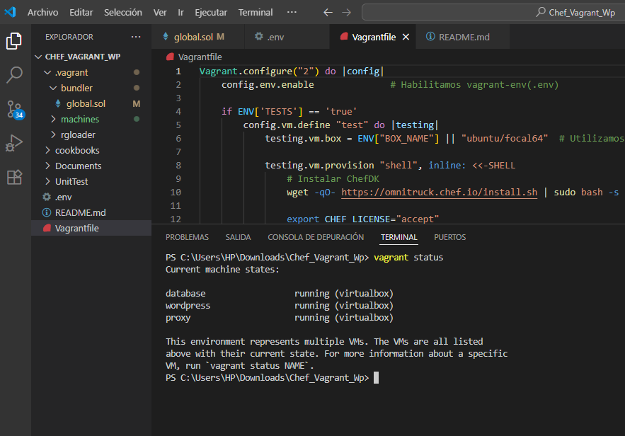

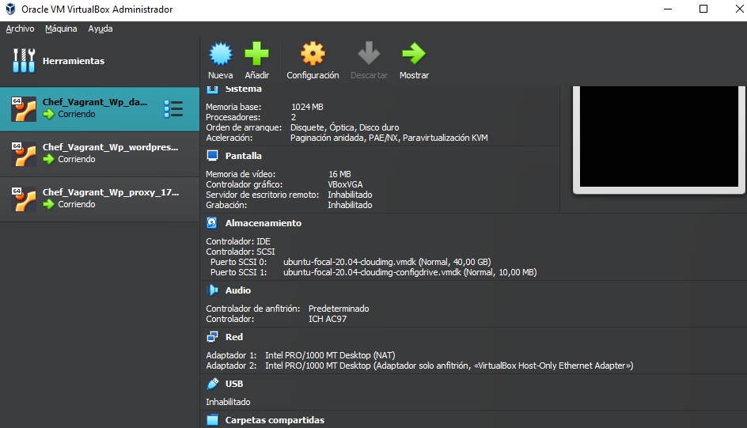

---

### Anexo B – Acceso a WordPress desde el navegador
Evidenciamos que el entorno fue correctamente desplegado y accesible en `http://192.168.56.10:8080/`.

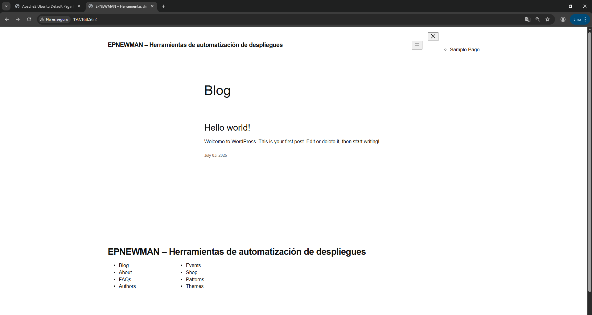
---

### Anexo C – Configuraciones de red sin autenticación en `Vagrantfile`

Para cada una de las máquinas (database, wordpress, proxy), y eso evidencia la exposición de RED sin restricciones.

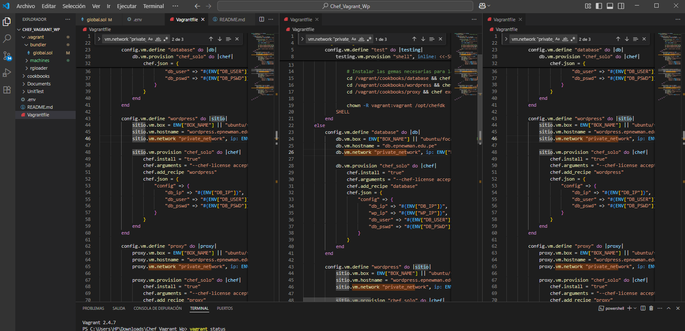


---

### Anexo D – Credenciales visibles en archivos de configuración
Captura del archivo `.env` o `attributes/default.rb` mostrando contraseñas sin cifrado.

Se identificaron archivos donde las credenciales de acceso a la base de datos (usuario y contraseña) están visibles en texto plano, lo que representa un riesgo de seguridad significativo si el repositorio o el entorno es expuesto sin protección adecuada.

En el archivo `.env` contiene las credenciales `DB_USER` y `DB_PSWD` directamente visibles y sin cifrado:

```env
DB_IP=192.168.56.20
WP_IP=192.168.56.10
PROXY_IP=192.168.56.2
DB_USER = 'wordpress'
DB_PSWD = 'Epnewman123'
```

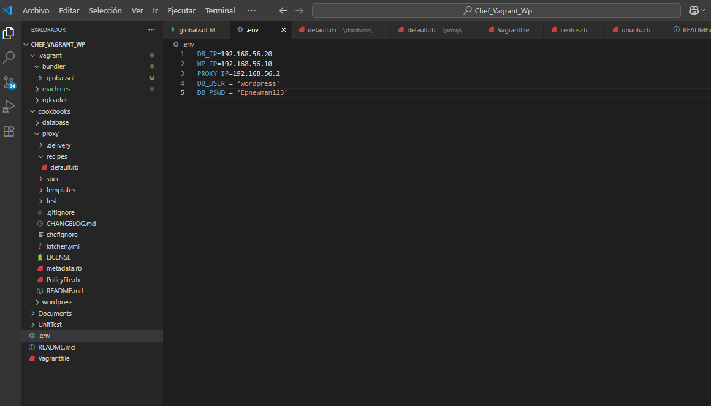

---

### Anexo E – Versiones antiguas de software instaladas
Evidencia de comandos como `apachectl -v`, `mysql --version`, etc., que muestran software obsoleto.

Las versiones del software instalado en la máquina virtual `wordpress`, correspondiente al entorno DevIA360. Se encontraron versiones que ya no están soportadas oficialmente o que presentan riesgo de vulnerabilidades.


```bash
vagrant ssh wordpress
apache2 -v
```

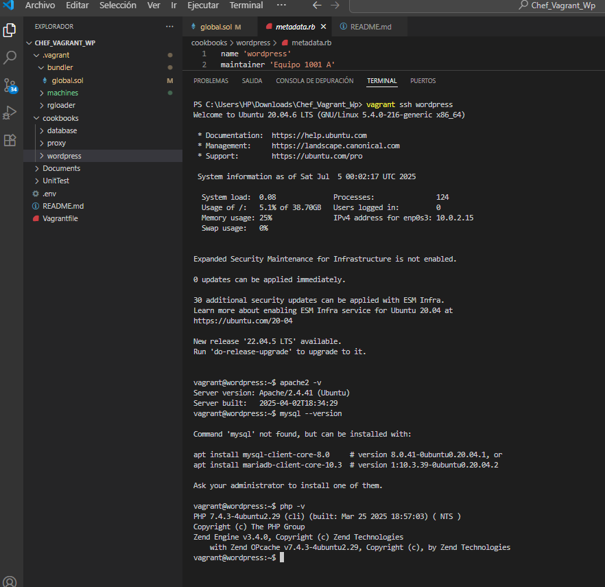


---

### Anexo F – Ausencia de logs persistentes en `/var/log/`
Comprobación de que no se están generando ni almacenando registros relevantes.


La VM `wordpress` contiene algunos logs en `/var/log/` (ej. `auth.log`, `syslog`, `wordpress_error.log`), pero no se encontraron registros para otros servicios como base de datos o proxy, lo que indica cobertura limitada de logging. El acceso fue el siguiente:

```bash
vagrant ssh wordpress
ls -l /var/log/
```

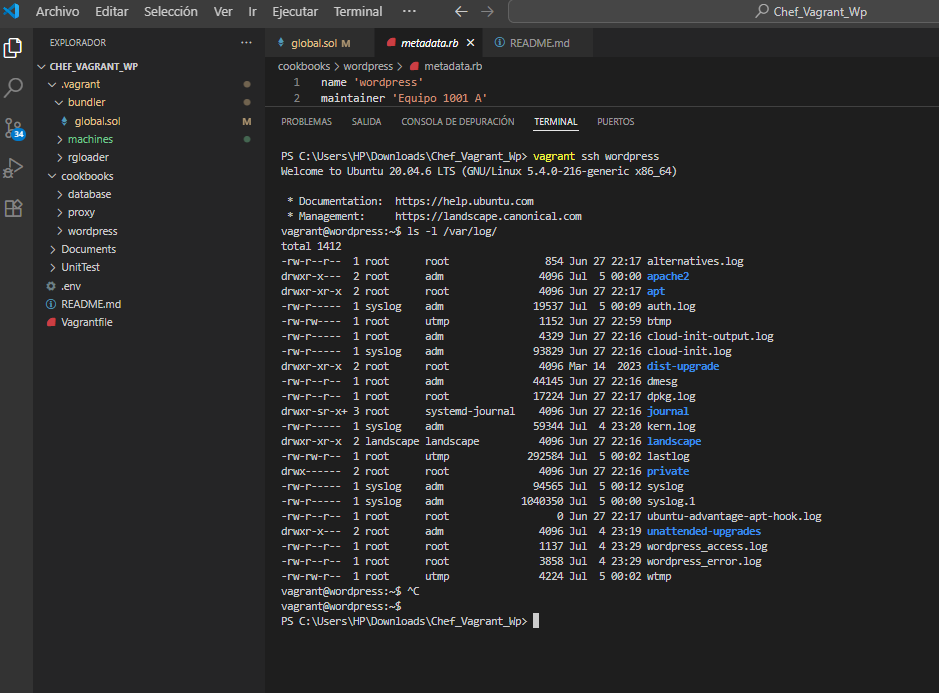


---

### Anexo G – Falta de segmentación entre entornos (dev/test/prod)
Evidencia de que el entorno no diferencia perfiles, mostrando un único `Vagrantfile` o recetas sin condiciones.

Las recetas en los cookbooks `proxy`, `wordpress` y `database` solo diferencian configuraciones por sistema operativo (`platform_family`), pero no implementan separación entre entornos (`development`, `production`, etc.). No se usa `chef_environment` ni estructuras condicionales para entornos. Revisión manual de los archivos `default.rb` en cada cookbook. No se encontró ninguna lógica de segmentación por entorno, lo que representa un riesgo en escenarios de despliegue real.


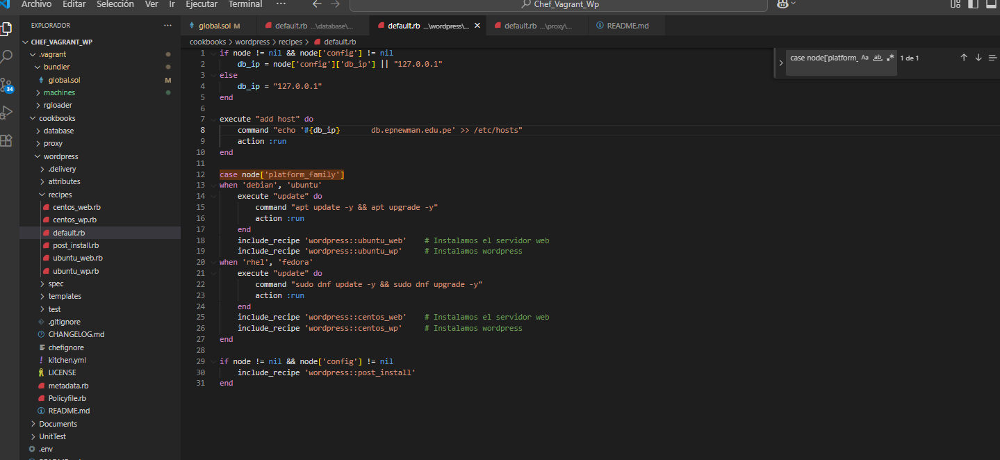

---

### Anexo X – Puertos expuestos sin control


El archivo kitchen.yml de los cookbooks (proxy, wordpress, database) contiene líneas comentadas:

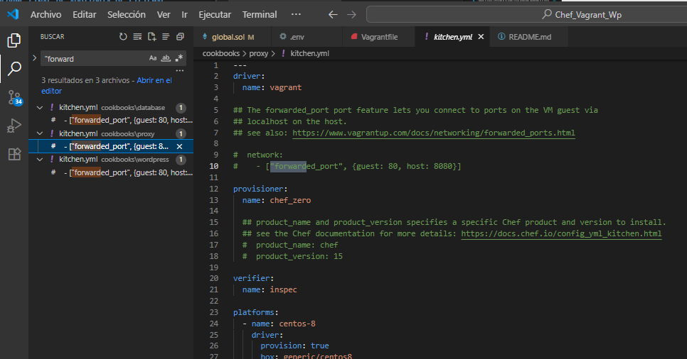

Eso significa que hay intención o posibilidad de exponer el puerto 80 al host a través del 8080, pero actualmente está deshabilitado (comentado). Aun así, debe documentarse como posible riesgo si no hay controles para evitar que se habilite en producción.


### Anexo Z – Clonar repositorio base y levantar servicios

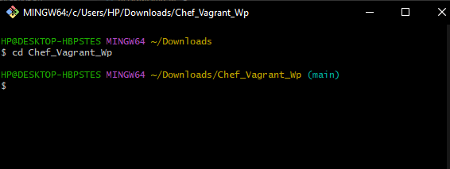

Esperar a que se provisionen las 3 máquinas (wordpress, database, proxy).

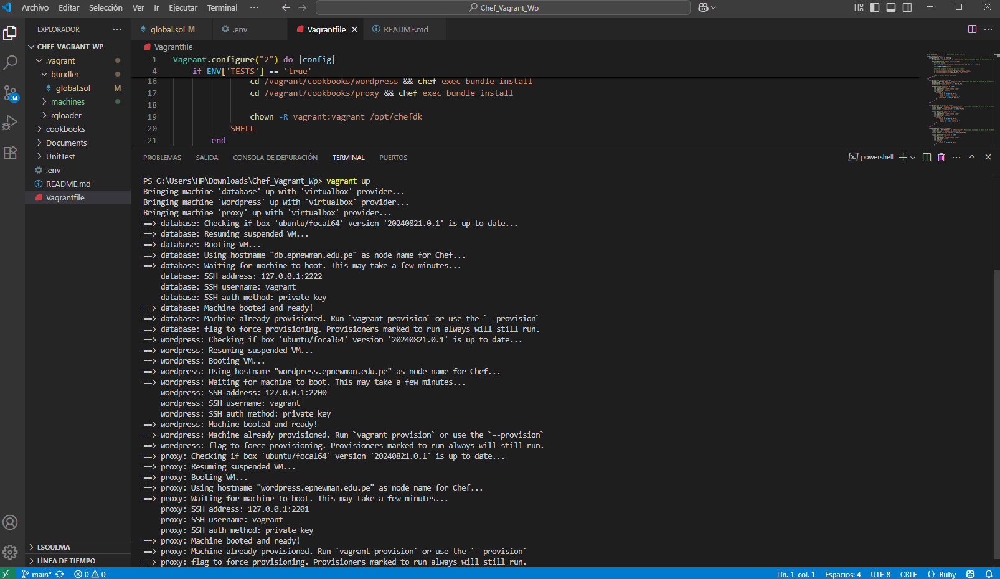


### Anexo R – Repositorio

https://github.com/MAYnerAC/AS_U3_EXAMEN_PRACTICO